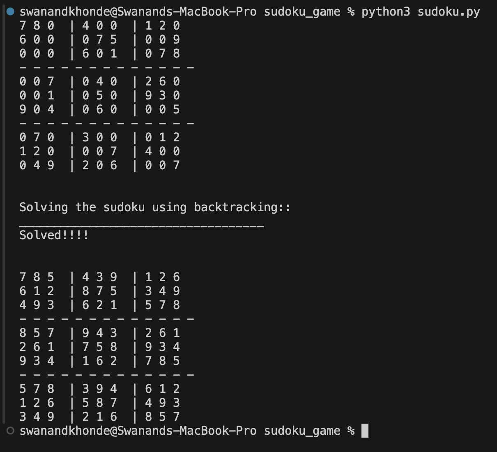
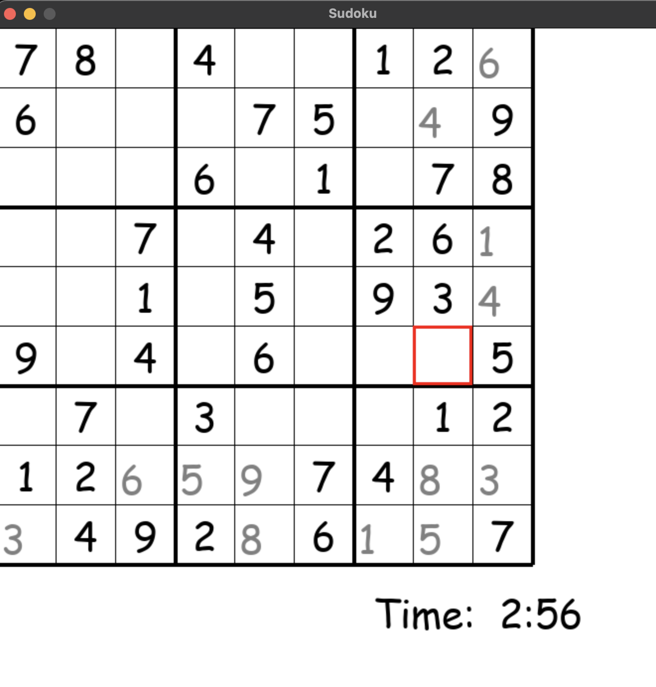

# Sudoku Game

This repository contains two Sudoku games: one played by AI and the other that can be played by humans via a GUI.

## Features

- Sudoku game with GUI for human play
- AI algorithm to solve Sudoku puzzles
- User can input their own puzzles
- Real-time solving demonstration by AI

## Requirements

- Python 3.x
- pygame

## Installation

1. Clone the repository:

   ```sh
   git clone https://github.com/Swanand58/sudoku_game.git
   cd sudoku_game
   ```

2. Install the required dependencies:
   ```sh
   pip install requirements.txt / pip3 install requirements.txt
   ```

## Usage

### Human Playable Game

Run the GUI game using the following command:

```sh
python GUI.py
```

### AI Solving Game

Run the AI game using the following command:

```sh
python sudoku.py
```

## Game Instructions

### Human Playable Game

- A Sudoku puzzle will be displayed on the screen.
- You can enter numbers into the empty cells.
- Press the solve button to let the AI solve the puzzle.

### AI Solver Game

- The AI will automatically start solving a displayed Sudoku puzzle.
- The solving process is demonstrated in real-time on the GUI.

## AI Solver

The AI solver uses a backtracking algorithm to solve Sudoku puzzles. It demonstrates the solving process in real-time on the GUI.

## Contributing

Contributions are welcome! Please open an issue or submit a pull request for any changes or enhancements.

## Screenshots



